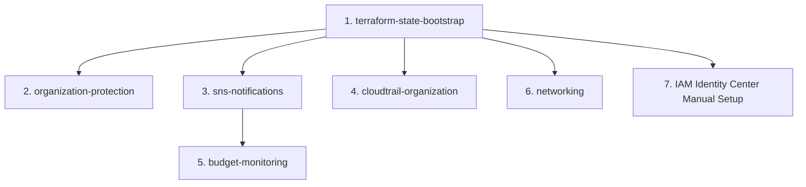

# AWS Organization Deployment Guide

Comprehensive guide for deploying a cost-optimized, secure AWS Organization setup for serverless workloads in eu-north-1.

## Table of Contents

1. [Overview](#overview)
2. [Prerequisites](#prerequisites)
3. [Architecture](#architecture)
4. [Cost Breakdown](#cost-breakdown)
5. [Deployment Sequence](#deployment-sequence)
6. [Module Deployments](#module-deployments)
7. [IAM Identity Center Setup](#iam-identity-center-setup)
8. [Verification](#verification)
9. [Backend Migration](#backend-migration)
10. [Troubleshooting](#troubleshooting)
11. [Rollback Procedures](#rollback-procedures)
12. [Post-Deployment Checklist](#post-deployment-checklist)

---

## Overview

This deployment establishes:
- **AWS Organization** with management and member accounts
- **IAM Identity Center** for centralized user access (4 users)
- **Service Control Policies** for region control, encryption, and organization protection
- **CloudTrail** organization trail with 30-day retention
- **Budget Monitoring** with SNS email alerts ($100 org, $90 member)
- **VPC Networking** with free gateway endpoints (no NAT gateways)
- **FinOps Lambda** for daily cost anomaly detection

**Target Environment:**
- Management Account: `<YOUR-MANAGEMENT-ACCOUNT-ID>`
- Member Account: `<YOUR-MEMBER-ACCOUNT-ID>`
- Organization ID: `<YOUR-ORG-ID>`
- Primary Region: eu-north-1
- Budget Region: us-east-1 (AWS Budgets service requirement)

---

## Prerequisites

### 1. AWS Organization

**Verify existing organization:**
```bash
aws organizations describe-organization
```

**Required structure:**
- Management account with organization enabled
- At least one member account
- Both accounts under OUs beneath root

### 2. AWS CLI Configuration

**Install AWS CLI:**
```bash
# Windows (via installer or winget)
winget install Amazon.AWSCLI

# Verify installation
aws --version  # Should show 2.x or higher
```

**Configure credentials:**
```bash
# Management account profile
aws configure --profile mgmt
# Enter access key, secret key, region (eu-north-1), output (json)

# Member account profile
aws configure --profile member
# Enter access key, secret key, region (eu-north-1), output (json)
```

### 3. Terraform

**Install Terraform:**
```bash
# Windows (via Chocolatey or direct download)
choco install terraform

# Verify installation
terraform version  # Should show 1.0 or higher
```

### 4. Required IAM Permissions

**Management Account:**
- `AdministratorAccess` or specific permissions for:
  - Organizations (read/write)
  - S3 (create buckets, manage policies)
  - CloudTrail (create/manage trails)
  - Budgets (create/manage budgets)
  - SNS (create topics, subscriptions)
  - IAM (create roles, policies)

**Member Account:**
- `AdministratorAccess` or specific permissions for:
  - VPC (create/manage networking)
  - Lambda (deploy functions)
  - S3/DynamoDB (for Terraform state)

---

## Architecture

### Account Structure

```
AWS Organization (o-1q2jgi9k7c)
├── Management Account (494367313227)
│   ├── IAM Identity Center (SSO)
│   ├── Service Control Policies
│   ├── CloudTrail S3 Bucket
│   ├── Terraform State (S3 + DynamoDB)
│   ├── Budget Monitoring
│   └── SNS Topics (us-east-1)
└── Member Account (758027491266)
    ├── VPC (10.0.0.0/23)
    ├── Lambda Functions
    └── Application Workloads
```

### Service Control Policies

| Policy | Purpose | Scope |
|--------|---------|-------|
| **Region Control** | Enforces eu-north-1 only | Organization root |
| **Encryption Baseline** | S3 public access blocking | Organization root |
| **Organization Protection** | Prevents org modifications from member | Organization root |

### Network Design

- **VPC CIDR**: 10.0.0.0/23 (512 IPs)
- **Public Subnets**: 10.0.0.0/25 (AZ-a), 10.0.0.128/25 (AZ-b)
- **Private Subnets**: 10.0.1.0/25 (AZ-a), 10.0.1.128/25 (AZ-b)
- **Gateway Endpoints**: S3, DynamoDB (free)
- **No NAT Gateways**: Cost optimization for serverless

---

## Cost Breakdown

| Service | Monthly Cost | Notes |
|---------|--------------|-------|
| **CloudTrail** | ~$0.50 | S3 storage only (30-day retention) |
| **AWS Budgets** | $0.00 | First 2 budgets free |
| **SNS** | ~$0.50 | Email notifications |
| **VPC** | $0.00 | No NAT gateways, free endpoints |
| **Lambda (FinOps)** | $0.00 | Free tier (1 execution/day) |
| **S3 (Terraform state)** | ~$0.10 | Minimal storage |
| **DynamoDB (state locks)** | $0.00 | Free tier |
| **IAM Identity Center** | $0.00 | Built-in directory (free) |
| **Total Monitoring** | **~$1.10/month** | |
| **Workload Budget** | $98.90 | Remaining for applications |

**Budget Alerts:**
- Organization: $100/month → postforyves@gmail.com (80%, 100% thresholds)
- Member Account: $90/month → monitoring@kuduworks.net (50%, 80%, 100% thresholds)

---

## Deployment Sequence

**Critical Order** (dependencies enforced):



**Deployment Timeline:**
- Terraform modules: ~45 minutes
- IAM Identity Center: ~15 minutes
- Email confirmations: ~5 minutes
- Backend migration: ~15 minutes
- **Total**: ~1.5 hours

---

## Module Deployments

### Module 1: Terraform State Bootstrap

**Purpose**: Creates S3 bucket and DynamoDB table for remote state storage.

**Location**: `deployments/aws/terraform-state-bootstrap/`

**Steps:**

```bash
cd deployments/aws/terraform-state-bootstrap/

# Configure credentials for management account
export AWS_PROFILE=mgmt

# Copy example configuration
cp terraform.tfvars.example terraform.tfvars

# Edit terraform.tfvars
nano terraform.tfvars
# Update:
#   aws_account_id = "<YOUR-MANAGEMENT-ACCOUNT-ID>"
#   environment = "prod"
#   aws_region = "eu-north-1"

# Deploy with local state
terraform init
terraform plan
terraform apply

# Save outputs
terraform output -json > ../outputs/state-bootstrap.json
cat ../outputs/state-bootstrap.json
```

**Expected Outputs:**
- `state_bucket_name`: fictional-octo-system-tfstate-<ACCOUNT-ID>
- `dynamodb_table_name`: terraform-state-locks
- `state_bucket_arn`: arn:aws:s3:::fictional-octo-system-tfstate-<ACCOUNT-ID>

**Verification:**
```bash
# Verify S3 bucket exists
aws s3 ls s3://fictional-octo-system-tfstate-<ACCOUNT-ID> --profile mgmt

# Verify DynamoDB table
aws dynamodb describe-table --table-name terraform-state-locks --region eu-north-1 --profile mgmt
```

---

### Module 2: Organization Protection SCP

**Purpose**: Prevents member accounts from modifying organization structure.

**Location**: `deployments/aws/policies/organization-protection/`

**Steps:**

```bash
cd deployments/aws/policies/organization-protection/

# Still using management account
export AWS_PROFILE=mgmt

# Copy configuration
cp terraform.tfvars.example terraform.tfvars
cp backend.tf.example backend.tf

# Edit terraform.tfvars
nano terraform.tfvars
# Update:
#   management_account_id = "<YOUR-MANAGEMENT-ACCOUNT-ID>"
#   aws_region = "eu-north-1"
#   environment = "prod"

# Keep backend.tf COMMENTED OUT for now (local state first)

# Deploy
terraform init
terraform plan
terraform apply

# Save outputs
terraform output -json > ../outputs/org-protection.json
```

**Expected Outputs:**
- `policy_id`: p-xxxxxxxx
- `policy_arn`: arn:aws:organizations::<ACCOUNT-ID>:policy/o-<ORG-ID>/service_control_policy/p-xxxxxxxx
- `organization_root_id`: r-xxxx

**Verification:**
```bash
# List organization policies
aws organizations list-policies --filter SERVICE_CONTROL_POLICY --profile mgmt

# Test from member account (should fail)
export AWS_PROFILE=member
aws organizations describe-organization  # Should succeed (read-only)
aws organizations create-organizational-unit --parent-id r-xxxx --name test  # Should fail
```

---

### Module 3: SNS Notifications

**Purpose**: Creates SNS topics for budget alerting (email notifications).

**Location**: `deployments/aws/sns-notifications/`

**Steps:**

```bash
cd deployments/aws/sns-notifications/

export AWS_PROFILE=mgmt

cp terraform.tfvars.example terraform.tfvars
cp backend.tf.example backend.tf

# Edit terraform.tfvars
nano terraform.tfvars
# Update:
#   org_alert_email = "postforyves@gmail.com"
#   member_alert_email = "monitoring@kuduworks.net"
#   aws_region = "us-east-1"  # Required for AWS Budgets
#   environment = "prod"

# Keep backend.tf COMMENTED OUT

# Deploy
terraform init
terraform plan
terraform apply

# Save outputs
terraform output -json > ../outputs/sns-notifications.json
```

**Expected Outputs:**
- `org_sns_topic_arn`: arn:aws:sns:us-east-1:<ACCOUNT-ID>:org-budget-alerts-prod
- `member_sns_topic_arn`: arn:aws:sns:us-east-1:<ACCOUNT-ID>:member-budget-alerts-prod

**CRITICAL - Email Confirmation:**
```bash
# Two emails will be sent for confirmation:
# 1. postforyves@gmail.com (org budget alerts)
# 2. monitoring@kuduworks.net (member budget alerts)

# Click "Confirm subscription" links in both emails
# Verify subscriptions confirmed:
aws sns list-subscriptions --region us-east-1 --profile mgmt | grep SubscriptionArn
```

**Troubleshooting:**
- If emails not received, check spam/junk folders
- Resend confirmation: `aws sns subscribe --topic-arn <TOPIC-ARN> --protocol email --notification-endpoint <EMAIL> --region us-east-1 --profile mgmt`

---

### Module 4: CloudTrail Organization

**Purpose**: Multi-account audit logging with 30-day retention.

**Location**: `deployments/aws/cloudtrail-organization/`

**Steps:**

```bash
cd deployments/aws/cloudtrail-organization/

export AWS_PROFILE=mgmt

cp terraform.tfvars.example terraform.tfvars
cp backend.tf.example backend.tf

# Edit terraform.tfvars
nano terraform.tfvars
# Update:
#   member_account_id = "<YOUR-MEMBER-ACCOUNT-ID>"
#   organization_id = "<YOUR-ORG-ID>"
#   aws_region = "eu-north-1"
#   environment = "prod"
#   retention_days = 30

# Keep backend.tf COMMENTED OUT

# Deploy
terraform init
terraform plan
terraform apply

# Save outputs
terraform output -json > ../outputs/cloudtrail.json
```

**Expected Outputs:**
- `cloudtrail_bucket_name`: fictional-octo-system-cloudtrail-<ACCOUNT-ID>
- `cloudtrail_arn`: arn:aws:cloudtrail:eu-north-1:<ACCOUNT-ID>:trail/fictional-octo-system-org-trail-prod

**Verification:**
```bash
# Verify trail is logging
aws cloudtrail get-trail-status --name fictional-octo-system-org-trail-prod --region eu-north-1 --profile mgmt

# Check S3 bucket for logs (may take 15 minutes)
aws s3 ls s3://fictional-octo-system-cloudtrail-<ACCOUNT-ID>/AWSLogs/ --profile mgmt

# Test member account read access
export AWS_PROFILE=member
aws sts assume-role --role-arn arn:aws:iam::<MEMBER-ACCOUNT-ID>:role/aws-reserved/sso.amazonaws.com/eu-north-1/AWSReservedSSO_AdministratorAccess_*
# (Use temporary credentials to list logs)
```

---

### Module 5: Budget Monitoring

**Purpose**: Two-tier budget tracking with SNS email alerts.

**Location**: `deployments/aws/budget-monitoring/`

**Steps:**

```bash
cd deployments/aws/budget-monitoring/

export AWS_PROFILE=mgmt

cp terraform.tfvars.example terraform.tfvars
cp backend.tf.example backend.tf

# Edit terraform.tfvars
nano terraform.tfvars
# Update:
#   org_budget_limit = 100
#   member_budget_limit = 90
#   member_account_id = "<YOUR-MEMBER-ACCOUNT-ID>"
#   org_sns_topic_arn = "<ORG-TOPIC-ARN-FROM-MODULE-3>"
#   member_sns_topic_arn = "<MEMBER-TOPIC-ARN-FROM-MODULE-3>"
#   budget_start_date = "2025-01-01"  # Current month

# Keep backend.tf COMMENTED OUT

# Deploy
terraform init
terraform plan
terraform apply

# Save outputs
terraform output -json > ../outputs/budgets.json
```

**Expected Outputs:**
- `org_budget_name`: fictional-octo-system-org-budget-prod
- `member_budget_name`: fictional-octo-system-member-budget-prod

**Verification:**
```bash
# List budgets
aws budgets describe-budgets --account-id <YOUR-MANAGEMENT-ACCOUNT-ID> --region us-east-1 --profile mgmt

# View budget details
aws budgets describe-budget --account-id <YOUR-MANAGEMENT-ACCOUNT-ID> --budget-name fictional-octo-system-org-budget-prod --region us-east-1 --profile mgmt
```

---

### Module 6: VPC Networking

**Purpose**: VPC with free gateway endpoints (no NAT gateways).

**Location**: `deployments/aws/networking/`

**Steps:**

```bash
cd deployments/aws/networking/

# Switch to member account
export AWS_PROFILE=member

cp terraform.tfvars.example terraform.tfvars
cp backend.tf.example backend.tf

# Edit terraform.tfvars
nano terraform.tfvars
# Update:
#   vpc_cidr = "10.0.0.0/23"
#   public_subnet_a_cidr = "10.0.0.0/25"
#   public_subnet_b_cidr = "10.0.0.128/25"
#   private_subnet_a_cidr = "10.0.1.0/25"
#   private_subnet_b_cidr = "10.0.1.128/25"
#   aws_region = "eu-north-1"
#   environment = "prod"

# Keep backend.tf COMMENTED OUT

# Deploy
terraform init
terraform plan
terraform apply

# Save outputs
terraform output -json > ../outputs/networking.json
```

**Expected Outputs:**
- `vpc_id`: vpc-xxxxxxxxxxxxxxxxx
- `public_subnet_a_id`: subnet-xxxxxxxxxxxxxxxxx
- `s3_endpoint_id`: vpce-xxxxxxxxxxxxxxxxx
- `dynamodb_endpoint_id`: vpce-xxxxxxxxxxxxxxxxx

**Verification:**
```bash
# Verify VPC
aws ec2 describe-vpcs --vpc-ids <VPC-ID> --region eu-north-1 --profile member

# Verify subnets
aws ec2 describe-subnets --filters "Name=vpc-id,Values=<VPC-ID>" --region eu-north-1 --profile member

# Verify gateway endpoints
aws ec2 describe-vpc-endpoints --filters "Name=vpc-id,Values=<VPC-ID>" --region eu-north-1 --profile member
```

---

## IAM Identity Center Setup

**Purpose**: Centralized user authentication for 4 users across management and member accounts.

**Location**: AWS Console (manual steps) + CLI commands

### Step 1: Enable IAM Identity Center

**Console:**
1. Navigate to: https://console.aws.amazon.com/singlesignon/
2. Click **"Enable IAM Identity Center"**
3. Select **"Built-in directory"** (free, up to 50 users)
4. Choose region: **eu-north-1**
5. Click **"Create"**

**CLI Verification:**
```bash
aws sso-admin list-instances --region eu-north-1 --profile mgmt
# Save InstanceArn and IdentityStoreId for next steps
```

### Step 2: Create Users

**Console:**
1. Go to: IAM Identity Center → Users
2. Click **"Add user"** (repeat 4 times)

**User Details:**
| Username | Email | Groups | Purpose |
|----------|-------|--------|---------|
| admin1 | postforyves@gmail.com | Admins | Emergency admin |
| admin2 | laingui@protonmail.com | Admins | Emergency admin |
| dev1 | <DEV1-EMAIL> | Developers | Standard developer |
| dev2 | <DEV2-EMAIL> | Developers | Standard developer |

**CLI Alternative:**
```bash
# Get identity store ID
IDENTITY_STORE_ID=$(aws sso-admin list-instances --region eu-north-1 --profile mgmt --query 'Instances[0].IdentityStoreId' --output text)

# Create users
aws identitystore create-user --identity-store-id $IDENTITY_STORE_ID --user-name admin1 --display-name "Admin User 1" --emails Value=postforyves@gmail.com,Primary=true --region eu-north-1 --profile mgmt

aws identitystore create-user --identity-store-id $IDENTITY_STORE_ID --user-name admin2 --display-name "Admin User 2" --emails Value=laingui@protonmail.com,Primary=true --region eu-north-1 --profile mgmt

# Repeat for dev1, dev2
```

### Step 3: Create Permission Sets

**Console:**
1. Go to: IAM Identity Center → Permission sets
2. Click **"Create permission set"** (repeat 3 times)

**Permission Sets:**

| Name | Description | AWS Managed Policy |
|------|-------------|--------------------|
| **AdministratorAccess** | Full admin access | AdministratorAccess |
| **PowerUserAccess** | All services except IAM | PowerUserAccess |
| **ViewOnlyAccess** | Read-only across all services | ViewOnlyAccess |

**CLI:**
```bash
# Get SSO instance ARN
SSO_INSTANCE_ARN=$(aws sso-admin list-instances --region eu-north-1 --profile mgmt --query 'Instances[0].InstanceArn' --output text)

# Create AdministratorAccess permission set
aws sso-admin create-permission-set --instance-arn $SSO_INSTANCE_ARN --name AdministratorAccess --description "Full administrator access" --session-duration PT12H --region eu-north-1 --profile mgmt

# Attach managed policy
ADMIN_PS_ARN=$(aws sso-admin list-permission-sets --instance-arn $SSO_INSTANCE_ARN --region eu-north-1 --profile mgmt --query 'PermissionSets[0]' --output text)

aws sso-admin attach-managed-policy-to-permission-set --instance-arn $SSO_INSTANCE_ARN --permission-set-arn $ADMIN_PS_ARN --managed-policy-arn arn:aws:iam::aws:policy/AdministratorAccess --region eu-north-1 --profile mgmt

# Repeat for PowerUserAccess, ViewOnlyAccess
```

### Step 4: Assign Users to Accounts

**Management Account Assignments:**
| User | Permission Set | Purpose |
|------|----------------|---------|
| admin1 | AdministratorAccess | Emergency access |
| admin2 | AdministratorAccess | Emergency access |

**Member Account Assignments:**
| User | Permission Set | Purpose |
|------|----------------|---------|
| admin1 | AdministratorAccess | Full control |
| admin2 | AdministratorAccess | Full control |
| dev1 | PowerUserAccess | Development work |
| dev2 | ViewOnlyAccess | Monitoring only |

**Console:**
1. Go to: IAM Identity Center → AWS accounts
2. Select **Management Account** → **Assign users or groups**
3. Select users: admin1, admin2
4. Select permission set: AdministratorAccess
5. Click **"Assign"**
6. Repeat for Member Account with all users

**CLI:**
```bash
# Get account IDs
MGMT_ACCOUNT_ID="<YOUR-MANAGEMENT-ACCOUNT-ID>"
MEMBER_ACCOUNT_ID="<YOUR-MEMBER-ACCOUNT-ID>"

# Get user IDs
ADMIN1_ID=$(aws identitystore list-users --identity-store-id $IDENTITY_STORE_ID --filters AttributePath=UserName,AttributeValue=admin1 --region eu-north-1 --profile mgmt --query 'Users[0].UserId' --output text)

# Create account assignment (admin1 → management account → AdministratorAccess)
aws sso-admin create-account-assignment --instance-arn $SSO_INSTANCE_ARN --target-id $MGMT_ACCOUNT_ID --target-type AWS_ACCOUNT --permission-set-arn $ADMIN_PS_ARN --principal-type USER --principal-id $ADMIN1_ID --region eu-north-1 --profile mgmt

# Repeat for all user/account/permission set combinations
```

### Step 5: User Activation

**Email Invitations:**
- Each user receives activation email
- Users set password (minimum 8 characters, mixed case, numbers, symbols)
- MFA enrollment (optional but recommended)

**Access Portal:**
- URL: https://d-xxxxxxxxxx.awsapps.com/start
- Users login with username/password
- Select account → Select permission set → Click "Management console"

**Verification:**
```bash
# Test SSO login (CLI)
aws configure sso
# SSO start URL: https://d-xxxxxxxxxx.awsapps.com/start
# SSO region: eu-north-1
# Profile name: sso-admin

aws sts get-caller-identity --profile sso-admin
```

---

## Verification

### 1. Service Control Policies

**Region Control:**
```bash
# Should succeed (eu-north-1)
aws ec2 describe-regions --region eu-north-1 --profile member

# Should fail (us-east-1)
aws ec2 describe-instances --region us-east-1 --profile member
# Error: User is not authorized to perform: ec2:DescribeInstances
```

**Organization Protection:**
```bash
# From member account
export AWS_PROFILE=member

# Read should work
aws organizations describe-organization

# Write should fail
aws organizations create-organizational-unit --parent-id r-xxxx --name test
# Error: AccessDeniedException
```

### 2. CloudTrail Logging

**Check trail status:**
```bash
aws cloudtrail get-trail-status --name fictional-octo-system-org-trail-prod --region eu-north-1 --profile mgmt
```

**Verify logs:**
```bash
# List recent logs
aws s3 ls s3://fictional-octo-system-cloudtrail-<ACCOUNT-ID>/AWSLogs/<ACCOUNT-ID>/CloudTrail/eu-north-1/$(date +%Y/%m/%d)/ --profile mgmt

# Download sample log
aws s3 cp s3://fictional-octo-system-cloudtrail-<ACCOUNT-ID>/AWSLogs/<ACCOUNT-ID>/CloudTrail/eu-north-1/$(date +%Y/%m/%d)/<LOG-FILE>.json.gz . --profile mgmt

# Extract and view
gunzip <LOG-FILE>.json.gz
cat <LOG-FILE>.json | jq .
```

### 3. Budget Alerts

**Check budget current spend:**
```bash
aws budgets describe-budget --account-id <YOUR-MANAGEMENT-ACCOUNT-ID> --budget-name fictional-octo-system-org-budget-prod --region us-east-1 --profile mgmt --query 'Budget.CalculatedSpend.ActualSpend'
```

**Test SNS subscriptions:**
```bash
# List subscriptions
aws sns list-subscriptions --region us-east-1 --profile mgmt

# Verify status is "Confirmed"
aws sns get-subscription-attributes --subscription-arn <SUBSCRIPTION-ARN> --region us-east-1 --profile mgmt
```

### 4. VPC Connectivity

**Test S3 endpoint:**
```bash
# From Lambda or EC2 in private subnet
aws s3 ls s3://fictional-octo-system-tfstate-<ACCOUNT-ID> --region eu-north-1
# Should route through VPC endpoint (no NAT gateway needed)
```

**Test DynamoDB endpoint:**
```bash
aws dynamodb list-tables --region eu-north-1
# Should route through VPC endpoint
```

### 5. IAM Identity Center

**Test SSO login:**
1. Navigate to: https://d-xxxxxxxxxx.awsapps.com/start
2. Login as dev1
3. Select Member Account → PowerUserAccess
4. Verify access to AWS Console
5. Try to modify IAM roles (should fail)
6. Try to create S3 bucket (should succeed)

---

## Backend Migration

**Purpose**: Migrate from local state files to centralized S3 backend.

**WARNING**: Complete all module deployments before migrating. Migration is irreversible without manual state recovery.

### Migration Checklist

- [ ] All 6 modules deployed successfully with local state
- [ ] All outputs captured in `../outputs/*.json` files
- [ ] State bucket verified and accessible
- [ ] DynamoDB table for locking verified

### Module-by-Module Migration

**For each module** (example with organization-protection):

```bash
cd deployments/aws/policies/organization-protection/

# 1. Edit backend.tf (uncomment configuration)
nano backend.tf
# Uncomment terraform block and update bucket name:
#   bucket = "fictional-octo-system-tfstate-<YOUR-MANAGEMENT-ACCOUNT-ID>"

# 2. Initialize with migration prompt
terraform init -migrate-state

# Output:
# Terraform detected that the backend type changed from "local" to "s3".
# Do you want to copy existing state to the new backend? (yes/no): yes

# 3. Verify migration
terraform plan
# Should show: "No changes. Your infrastructure matches the configuration."

# 4. Confirm state in S3
aws s3 ls s3://fictional-octo-system-tfstate-<ACCOUNT-ID>/aws/policies/organization-protection/ --profile mgmt

# 5. Delete local state files
rm terraform.tfstate terraform.tfstate.backup
```

**Repeat for all modules:**
1. organization-protection
2. sns-notifications
3. cloudtrail-organization
4. budget-monitoring
5. networking (use member account profile)
6. terraform-state-bootstrap (last - self-migration)

### Terraform State Bootstrap Self-Migration

**Special case** (bootstrapping module migrates itself):

```bash
cd deployments/aws/terraform-state-bootstrap/

# Create backend.tf
cat > backend.tf <<EOF
terraform {
  backend "s3" {
    bucket         = "fictional-octo-system-tfstate-<YOUR-MANAGEMENT-ACCOUNT-ID>"
    key            = "aws/terraform-state-bootstrap/terraform.tfstate"
    region         = "eu-north-1"
    dynamodb_table = "terraform-state-locks"
    encrypt        = true
  }
}
EOF

# Migrate
terraform init -migrate-state

# Verify
terraform plan
aws s3 ls s3://fictional-octo-system-tfstate-<ACCOUNT-ID>/aws/terraform-state-bootstrap/ --profile mgmt
```

### Troubleshooting Migration

**Error: Backend initialization failed**
```bash
# Check bucket exists
aws s3 ls s3://fictional-octo-system-tfstate-<ACCOUNT-ID> --profile mgmt

# Check DynamoDB table
aws dynamodb describe-table --table-name terraform-state-locks --region eu-north-1 --profile mgmt
```

**Error: State lock not released**
```bash
# List lock
aws dynamodb scan --table-name terraform-state-locks --region eu-north-1 --profile mgmt

# Force release (use with caution)
aws dynamodb delete-item --table-name terraform-state-locks --key '{"LockID":{"S":"fictional-octo-system-tfstate-<ACCOUNT-ID>/aws/module/terraform.tfstate-md5"}}' --region eu-north-1 --profile mgmt
```

---

## Troubleshooting

### General Issues

#### Terraform Errors

**Error: Provider configuration not present**
```bash
# Solution: Ensure AWS_PROFILE environment variable is set
export AWS_PROFILE=mgmt
# Or specify in provider block:
provider "aws" {
  profile = "mgmt"
  region  = "eu-north-1"
}
```

**Error: No valid credential sources found**
```bash
# Solution: Reconfigure AWS CLI
aws configure --profile mgmt
# Verify credentials
aws sts get-caller-identity --profile mgmt
```

#### SCP Issues

**Error: Access denied for allowed actions**
```bash
# Check SCP attachments
aws organizations list-policies-for-target --target-id r-xxxx --filter SERVICE_CONTROL_POLICY --profile mgmt

# Verify SCP content
aws organizations describe-policy --policy-id p-xxxxxxxx --profile mgmt

# Test with IAM Policy Simulator
https://policysim.aws.amazon.com/
```

#### CloudTrail Issues

**Error: Trail not logging**
```bash
# Check trail status
aws cloudtrail get-trail-status --name fictional-octo-system-org-trail-prod --region eu-north-1 --profile mgmt

# Verify S3 bucket policy
aws s3api get-bucket-policy --bucket fictional-octo-system-cloudtrail-<ACCOUNT-ID> --profile mgmt

# Test CloudTrail write permissions
aws cloudtrail put-event-selectors --trail-name fictional-octo-system-org-trail-prod --event-selectors '[{"ReadWriteType":"All","IncludeManagementEvents":true}]' --region eu-north-1 --profile mgmt
```

#### Budget Alert Issues

**Error: Budget notifications not received**
```bash
# Check SNS subscription status
aws sns list-subscriptions-by-topic --topic-arn <TOPIC-ARN> --region us-east-1 --profile mgmt

# Verify subscription confirmed
aws sns get-subscription-attributes --subscription-arn <SUBSCRIPTION-ARN> --region us-east-1 --profile mgmt

# Resend confirmation email
aws sns subscribe --topic-arn <TOPIC-ARN> --protocol email --notification-endpoint <EMAIL> --region us-east-1 --profile mgmt
```

**Error: Budget not tracking spend**
```bash
# Verify budget configuration
aws budgets describe-budget --account-id <ACCOUNT-ID> --budget-name fictional-octo-system-org-budget-prod --region us-east-1 --profile mgmt

# Check Cost Explorer data availability (24-hour delay)
aws ce get-cost-and-usage --time-period Start=$(date -d '7 days ago' +%Y-%m-%d),End=$(date +%Y-%m-%d) --granularity DAILY --metrics BlendedCost --profile mgmt
```

#### VPC Issues

**Error: Lambda can't access internet**
```bash
# Verify Lambda is in private subnet with no NAT gateway
# Solution 1: Move Lambda to public subnet
# Solution 2: Use VPC endpoints for AWS services
# Solution 3: Add NAT Gateway (costs $32/month)

# Check VPC endpoints
aws ec2 describe-vpc-endpoints --filters "Name=vpc-id,Values=<VPC-ID>" --region eu-north-1 --profile member
```

---

## Rollback Procedures

### Critical Rollback Scenarios

#### 1. SCP Breaking Access

**Symptom**: Cannot access AWS Console or CLI from member account.

**Rollback**:
```bash
# From management account
export AWS_PROFILE=mgmt

# Detach problematic SCP
aws organizations detach-policy --policy-id p-xxxxxxxx --target-id r-xxxx

# Verify detached
aws organizations list-policies-for-target --target-id r-xxxx --filter SERVICE_CONTROL_POLICY

# Destroy Terraform module
cd deployments/aws/policies/organization-protection/
terraform destroy
```

#### 2. CloudTrail Logging Failure

**Symptom**: Audit logs not being written to S3.

**Rollback**:
```bash
export AWS_PROFILE=mgmt

# Stop trail
aws cloudtrail stop-logging --name fictional-octo-system-org-trail-prod --region eu-north-1

# Destroy module
cd deployments/aws/cloudtrail-organization/
terraform destroy

# Manually delete S3 bucket if needed
aws s3 rb s3://fictional-octo-system-cloudtrail-<ACCOUNT-ID> --force
```

#### 3. Budget Alert Spam

**Symptom**: Too many alert emails due to misconfigured thresholds.

**Rollback**:
```bash
export AWS_PROFILE=mgmt

# Delete budgets
aws budgets delete-budget --account-id <ACCOUNT-ID> --budget-name fictional-octo-system-org-budget-prod --region us-east-1

cd deployments/aws/budget-monitoring/
terraform destroy

# SNS topics remain (can reuse for future budgets)
```

#### 4. VPC Resource Conflicts

**Symptom**: Cannot delete VPC due to attached resources.

**Rollback**:
```bash
export AWS_PROFILE=member

# List VPC dependencies
aws ec2 describe-network-interfaces --filters "Name=vpc-id,Values=<VPC-ID>" --region eu-north-1

# Delete Lambda functions first
aws lambda list-functions --region eu-north-1 | grep <VPC-ID>
aws lambda delete-function --function-name <FUNCTION-NAME> --region eu-north-1

# Destroy networking module
cd deployments/aws/networking/
terraform destroy
```

### Full Environment Teardown

**WARNING**: This deletes ALL resources. Ensure data is backed up.

```bash
# Reverse order of deployment
cd deployments/aws/networking/
terraform destroy

cd deployments/aws/budget-monitoring/
terraform destroy

cd deployments/aws/cloudtrail-organization/
terraform destroy

cd deployments/aws/sns-notifications/
terraform destroy

cd deployments/aws/policies/organization-protection/
terraform destroy

cd deployments/aws/terraform-state-bootstrap/
# WARNING: This deletes state storage - all Terraform state will be lost
terraform destroy
```

**IAM Identity Center Cleanup** (manual):
1. Console → IAM Identity Center
2. Delete account assignments
3. Delete permission sets
4. Delete users
5. Delete groups
6. Disable IAM Identity Center

---

## Post-Deployment Checklist

### Security

- [ ] All SCP policies attached and tested
- [ ] CloudTrail logging verified for both accounts
- [ ] IAM Identity Center users activated with strong passwords
- [ ] MFA enabled for admin users (recommended)
- [ ] Emergency access tested from management account
- [ ] Member account organization modifications blocked
- [ ] Region control verified (eu-north-1 only)

### Cost Management

- [ ] Budget alerts configured and emails confirmed
- [ ] SNS subscriptions confirmed for both email addresses
- [ ] FinOps Lambda deployed and scheduled
- [ ] First budget alert test performed (optional: create test resource)
- [ ] Cost Explorer data available (24-hour delay expected)

### Networking

- [ ] VPC created with correct CIDR block
- [ ] Public and private subnets in 2 availability zones
- [ ] S3 and DynamoDB gateway endpoints functional
- [ ] No NAT gateways deployed (cost check)
- [ ] Default security group restrictive (egress only)

### State Management

- [ ] All Terraform state migrated to S3 backend
- [ ] DynamoDB state locking functional
- [ ] Local state files deleted
- [ ] State bucket versioning enabled
- [ ] State bucket encryption enabled

### Documentation

- [ ] All module outputs saved to `../outputs/*.json`
- [ ] IAM Identity Center access portal URL documented
- [ ] Account IDs and organization ID documented
- [ ] SNS topic ARNs recorded for future module additions
- [ ] VPC ID and subnet IDs recorded for application deployments

### Testing

- [ ] Deploy test Lambda function in private subnet
- [ ] Verify Lambda can access S3 via VPC endpoint
- [ ] Test IAM Identity Center login for all users
- [ ] Verify different permission sets (ViewOnly, PowerUser, Admin)
- [ ] Trigger test budget alert (create ~$50 resource, delete after)
- [ ] Review CloudTrail logs for test actions

### Next Steps

- [ ] Deploy application workloads to member account
- [ ] Configure additional security services (GuardDuty, SecurityHub) if budget allows
- [ ] Set up automated backups for critical data
- [ ] Implement CI/CD pipeline using GitHub OIDC (deployments/aws/iam/github-oidc/)
- [ ] Configure FinOps Lambda for custom cost anomaly thresholds
- [ ] Review first month's AWS bill against budget

---

## Additional Resources

### AWS Documentation

- [AWS Organizations Best Practices](https://docs.aws.amazon.com/organizations/latest/userguide/orgs_best-practices.html)
- [IAM Identity Center Getting Started](https://docs.aws.amazon.com/singlesignon/latest/userguide/getting-started.html)
- [Service Control Policies](https://docs.aws.amazon.com/organizations/latest/userguide/orgs_manage_policies_scps.html)
- [CloudTrail Organization Trails](https://docs.aws.amazon.com/awscloudtrail/latest/userguide/creating-trail-organization.html)
- [AWS Budgets](https://docs.aws.amazon.com/cost-management/latest/userguide/budgets-managing-costs.html)
- [VPC Gateway Endpoints](https://docs.aws.amazon.com/vpc/latest/privatelink/gateway-endpoints.html)

### Terraform

- [Terraform AWS Provider](https://registry.terraform.io/providers/hashicorp/aws/latest/docs)
- [Terraform Backend S3](https://developer.hashicorp.com/terraform/language/settings/backends/s3)
- [Terraform State Locking](https://developer.hashicorp.com/terraform/language/state/locking)

### Cost Optimization

- [AWS Free Tier](https://aws.amazon.com/free/)
- [AWS Pricing Calculator](https://calculator.aws/)
- [Cost Optimization Pillar - AWS Well-Architected](https://docs.aws.amazon.com/wellarchitected/latest/cost-optimization-pillar/welcome.html)

### Security

- [AWS Security Best Practices](https://docs.aws.amazon.com/securityhub/latest/userguide/securityhub-standards-fsbp.html)
- [IAM Best Practices](https://docs.aws.amazon.com/IAM/latest/UserGuide/best-practices.html)
- [VPC Security Best Practices](https://docs.aws.amazon.com/vpc/latest/userguide/vpc-security-best-practices.html)

---

## Support

For issues or questions:
1. Check module-specific README files in each deployment directory
2. Review AWS CloudTrail logs for detailed error messages
3. Consult AWS documentation links above
4. Open GitHub issue in this repository (if public)

**Emergency Contacts:**
- AWS Support: https://console.aws.amazon.com/support/
- Organization Admin: postforyves@gmail.com
- Member Account Admin: laingui@protonmail.com
- Monitoring Alerts: monitoring@kuduworks.net
