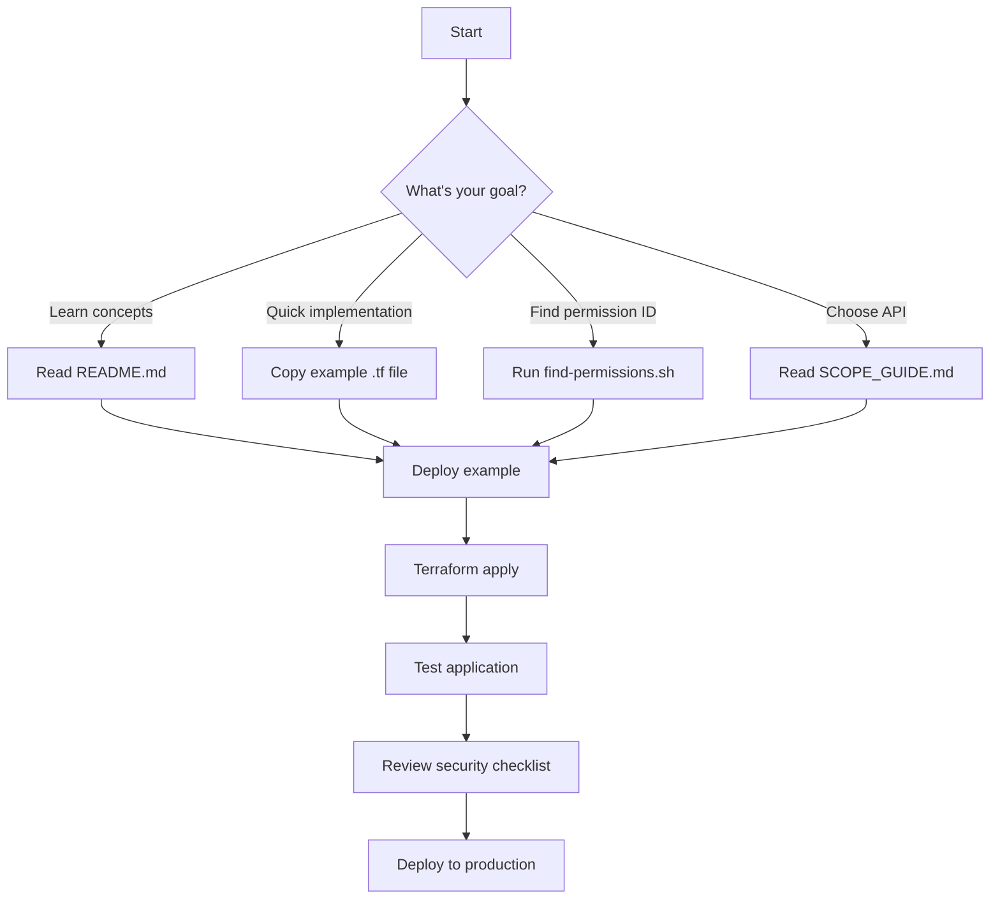

# 🎯 Azure AD App Registration Automation

## 🗂️ Repository Structure

```
deployments/azure/app-registration/
│
├── 📘 DOCUMENTATION (Start Here!)
│   ├── README.md              ⭐ Main guide - comprehensive overview
│   ├── SCOPE_GUIDE.md         🎯 When to use Graph vs ARM vs Custom APIs
│   ├── PERMISSIONS.md         🔐 40+ common Microsoft Graph permission IDs
│   ├── QUICK_REFERENCE.md     ⚡ One-page cheat sheet
│   └── SUMMARY.md             📊 What's included & how to use
│
├── 🔧 TERRAFORM MODULES
│   ├── main.tf                💎 Core app registration orchestration
│   ├── variables.tf           ⚙️  30+ configurable variables
│   ├── outputs.tf             📤 Essential outputs (IDs, secrets)
│   └── terraform.tfvars.example 📝 Sample configuration
│
├── 💡 EXAMPLES
│   ├── basic-app.tf           🌐 Web app with user sign-in
│   ├── daemon-service.tf      🤖 Background service (no user)
│   ├── github-actions-oidc.tf 🔄 CI/CD with passwordless auth
│   └── multi-tier-app.tf      🏗️  Frontend + Backend architecture
│
└── 🛠️ UTILITIES
    ├── find-permissions.sh    🔍 Interactive permission lookup tool
    └── .gitignore             🔒 Security (ignore secrets)
```

## 🚀 Getting Started (30 seconds)

```bash
# 1. Navigate to directory
cd deployments/azure/app-registration

# 2. Choose your starting point based on your need:

# For learning → Read documentation
cat README.md

# For quick reference → Open cheat sheet
cat QUICK_REFERENCE.md

# For implementation → Copy example
cp examples/basic-app.tf my-app.tf

# 3. Deploy
terraform init
terraform plan
terraform apply
```

## 📚 Documentation Navigator

### 🎓 I'm New to Azure AD App Registrations
**Start:** `README.md` → Overview section  
**Then:** `QUICK_REFERENCE.md` → Basic commands  
**Try:** `examples/basic-app.tf` → Simple example

### 🤔 I Need to Choose Between APIs
**Read:** `SCOPE_GUIDE.md` → Decision tree  
**Check:** Comparison tables (Graph vs ARM vs Custom)  
**Apply:** Decision checklist at the end

### 🔍 I Need Specific Permission IDs
**Use:** `find-permissions.sh` → Interactive search  
**Or:** `PERMISSIONS.md` → Pre-compiled list of 40+ IDs  
**Or:** Run Azure CLI commands in PERMISSIONS.md

### ⚡ I Need Quick Answers During Development
**Open:** `QUICK_REFERENCE.md` → One-page reference  
**Contains:** Commands, IDs, snippets, troubleshooting

### 🏗️ I'm Implementing a Specific Pattern
**Browse:** `examples/` directory  
**Options:**
- `basic-app.tf` - Web app with OAuth2
- `daemon-service.tf` - Background service
- `github-actions-oidc.tf` - CI/CD pipeline
- `multi-tier-app.tf` - Complex architecture

## 🎯 Use Case Quick Links

| I Want To... | Go To | What You'll Get |
|-------------|-------|----------------|
| Authenticate users in web app | `examples/basic-app.tf` | User.Read, OAuth2 flow |
| Run background service | `examples/daemon-service.tf` | Application permissions |
| Deploy via GitHub Actions | `examples/github-actions-oidc.tf` | Passwordless OIDC |
| Build API + Frontend | `examples/multi-tier-app.tf` | Custom scopes |
| Manage Azure resources | `SCOPE_GUIDE.md` → ARM section | RBAC patterns |
| Access Storage/Key Vault | `SCOPE_GUIDE.md` → Resource APIs | Direct SDK access |
| Find permission ID | `find-permissions.sh` | Interactive search |

## 🧠 Core Concepts (5-Minute Primer)

### 1️⃣ Permission Types
```
Delegated (Scope)          Application (Role)
      ↓                           ↓
Acts on behalf of user      Acts as the app itself
User must sign in          No user interaction
Example: User.Read         Example: User.Read.All
```

### 2️⃣ API Selection
```
Need to access...
├─ Microsoft 365 data (users, mail, Teams) → Microsoft Graph
├─ Azure infrastructure (VMs, storage) → Azure Resource Manager
└─ Your own services → Custom API permissions
```

### 3️⃣ Authentication Methods
```
Security Level:  Low ────────────────────────→ High
Methods:         Client Secret → Certificate → OIDC (Federated)
Rotation:        90 days       365 days       Short-lived tokens
Best For:        Dev/Testing   Production     CI/CD, Kubernetes
```

## 📖 Documentation Features

### README.md (Comprehensive Guide)
✅ Complete overview & prerequisites  
✅ 5 detailed use cases with code  
✅ Permission decision guidance  
✅ Secret rotation strategies  
✅ Security best practices  
✅ 50+ code examples (Python, JS, HCL, YAML)  

### SCOPE_GUIDE.md (API Selection)
✅ Decision tree for API choice  
✅ Comparison tables (Graph, ARM, Custom)  
✅ When to use each API (with examples)  
✅ 4 real-world scenarios  
✅ Common mistakes & corrections  
✅ Quick reference table for 20+ use cases  

### PERMISSIONS.md (Reference)
✅ 40+ Microsoft Graph permissions  
✅ Organized by category (User, Mail, etc.)  
✅ Each includes: ID, type, description  
✅ Ready-to-use Terraform snippets  
✅ Scripts to find more (Azure CLI, PowerShell)  

### QUICK_REFERENCE.md (Cheat Sheet)
✅ One-page printable reference  
✅ Common commands & permission IDs  
✅ Terraform templates  
✅ Authentication patterns  
✅ Troubleshooting guide  
✅ Security checklist  

## 🔐 Security Features

| Feature | Implementation | Benefit |
|---------|---------------|---------|
| Secret Rotation | `secret_rotation_days = 90` | Automatic rotation |
| Certificate Auth | `use_certificate_auth = true` | More secure than secrets |
| Passwordless OIDC | `enable_github_oidc = true` | Short-lived tokens |
| Key Vault Storage | `store_in_key_vault = true` | Centralized secrets |
| Least Privilege | Decision guides | Minimal permissions |

## 💻 Code Examples Coverage

- **Terraform (HCL)**: 8+ complete modules
- **Python**: 10+ examples (MSAL, Azure SDK)
- **JavaScript/Node.js**: 5+ examples (MSAL, Express)
- **YAML**: 3+ GitHub Actions workflows
- **Bash**: Interactive scripts
- **PowerShell**: Permission lookup commands

## 🎓 Learning Resources

### Beginner Path
1. `README.md` - Read "Overview" section
2. `QUICK_REFERENCE.md` - Familiarize with commands
3. `examples/basic-app.tf` - Run first example
4. `SCOPE_GUIDE.md` - Understand API choices

### Intermediate Path
1. `SCOPE_GUIDE.md` - Master API selection
2. `PERMISSIONS.md` - Learn common IDs
3. `examples/daemon-service.tf` - Application permissions
4. `README.md` - Study secret rotation

### Advanced Path
1. `examples/multi-tier-app.tf` - Complex patterns
2. `examples/github-actions-oidc.tf` - OIDC federation
3. `README.md` - Kubernetes workload identity
4. Custom implementations with guidance

## 🆘 Troubleshooting Quick Links

| Issue | Solution Location |
|-------|------------------|
| Permission denied | `QUICK_REFERENCE.md` → Common Issues |
| Can't find permission ID | `find-permissions.sh` or `PERMISSIONS.md` |
| Don't know which API | `SCOPE_GUIDE.md` → Decision Tree |
| Secret expired | `README.md` → Secret Rotation |
| GitHub Actions not working | `examples/github-actions-oidc.tf` → Setup |
| Need admin consent | `README.md` → Use Case 2 |

## 📊 At a Glance

```
┌─────────────────────────────────────────────────────────────┐
│  Azure AD App Registration Automation Suite                 │
├─────────────────────────────────────────────────────────────┤
│  📄 Documentation Pages:        4 comprehensive guides      │
│  🔧 Terraform Modules:          400+ lines of HCL           │
│  💡 Working Examples:           4 complete scenarios        │
│  🔐 Permission IDs:             40+ documented              │
│  💻 Code Samples:               50+ in multiple languages   │
│  🎯 Use Cases Covered:          7 major patterns            │
│  🛠️ Interactive Tools:          Permission lookup script    │
│  📈 Comparison Tables:          5 decision matrices         │
│  ✅ Security Features:          5 authentication methods    │
└─────────────────────────────────────────────────────────────┘
```

## 🎯 Your Next Steps



## 🌟 Key Highlights

### What Makes This Special
1. **Most comprehensive permission guidance** available
2. **Clear API selection** (Graph vs ARM vs Custom)
3. **Modern auth patterns** (OIDC, certificates)
4. **Production-ready** examples with Key Vault
5. **Developer-friendly** with interactive tools

### Unique Features
- ✨ Interactive permission lookup script
- ✨ Decision trees for API selection
- ✨ Graph vs ARM comparison (rare to find!)
- ✨ Passwordless authentication patterns
- ✨ Multi-tier application examples

## 📞 Support & Resources

- 📖 **Full Documentation**: Start with `README.md`
- 🔍 **Find Permissions**: Run `./find-permissions.sh`
- 💡 **Examples**: Browse `examples/` directory
- ⚡ **Quick Help**: Check `QUICK_REFERENCE.md`
- 🎯 **API Decisions**: Read `SCOPE_GUIDE.md`

---

**🎉 Ready to get started?**

```bash
cd deployments/azure/app-registration
cat README.md  # Start reading
# or
cp examples/basic-app.tf my-app.tf  # Start building
```

**Version:** 1.0.0 | **License:** MIT | **Maintained by:** KuduWorks
